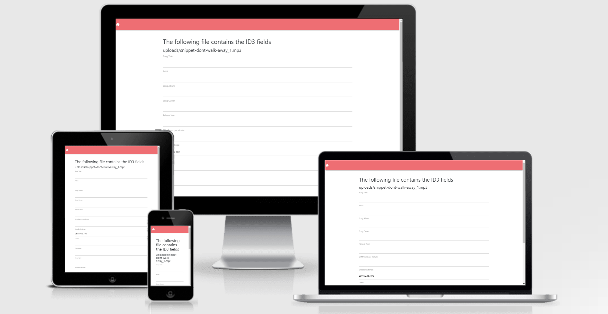

<h1 align="center">Audio Meta</h1>

[View the live project here.](http://audiometa.herokuapp.com/)

Audiometa is a handy application for editing metadata on audio files. Often this is badly supported on the mainstram operating systems, especially for more advanced attributes
like copyright holder, composer, artists, collaborators, author, genre etc are needed. In music business, and music distribution it's important to attain the correct metadata
on the creators work before distribution. Simply upload an audio file, and the program will render the existing metadata. Then you will be able to edit a variety of fields.
Save, and download. It's important to save before downloading, if not the latest changes will not be applied.

Audiometa is using the [mutagen](https://mutagen.readthedocs.io/en/latest/index.html) library to edit the audio file's ID3 data, or metadata. More about ID3 [here](https://en.wikipedia.org/wiki/ID3)

The audio file is stored temporarliy on a postgres backend in django during editing, and removed when download completed..or the user goes back to the "home" page.
Bootstrap alerts/messages are used for intuitive messaging for the user, when uploading..and saving. The UX perspective of this application have not been the main priority, but 
to be enhanced in the future.

<h2 align="center">
    
</h2>

## User Experience (UX)
-   ### User stories

    -  As a user in the music business, or others that find's this useful, I want to efficiently edit a wider variety of metadata in an audio file, so that
       I can prepare the audio file for distribution/release without having a hedeache.

-   ### Design
    -   #### Colour Scheme
        -   Standard [materializecss](https://materializecss.com/) : Black text, white background, red header/footer, green buttons. Green, amber, red for respectively success, warning and error messages. This is [bootstrap](https://getbootstrap.com/) 
    -   #### Typography
        -   Uses the materializecss standard fonts.
    -   #### Imagery
        -   None

        #### Media
        -  None

        #### Social Media
        -  None

    <h2 id="wireframes"></h2>
-   ### Wireframes/Mockup
    None


## Features

 -  User can upload an audio file of any type, and edit a wide variety of metadata / ID3. The following is supported at the moment:
 Refererence of all available ID3v2.3/4 fields is [here](https://mutagen.readthedocs.io/en/latest/api/id3_frames.html#id3v2-3-4-frames)
    <ul>
        <li>'TIT2': 'Song Title'</li>
        <li>'TALB': 'Song Album'</li>
        <li>'TOWN': 'Song Owner'</li>
        <li>'TORY': 'Release Year'</li>
        <li>'TOPE': 'Artist'</li>
        <li>'TBPM': 'BPM/Beats per minute'</li>
        <li>'TSSE': 'Encoder Settings'</li>
        <li>'TCON': 'Genre'</li>
        <li>'TCOM': 'Composer'</li>
        <li>'TCOP': 'Copyright'</li>
        <li>'TIPL': 'Involved Persons'</li>
    </ul>
-   Download after save
-   Works on all devices
-   Responsive on all devices


## Features to be added/fixed
-   Make a dropdown selection of all available id3 fields for more advanced usage.
-   If more people are using uploading at the same time, it can be an issue with querying the correct track. Cause when the app is rendering, saving, or downloading..
    it is using the following query: "last object inserted" to the database. This is not a good solution. A better solution would be to query the uploaded file by it's name,
    or unique user/session ID.
-   Posibility to add images to audio file.
-   Some parts of the css materialize syntax is being overridden by bootstrap. Should be fixed. This is the grid system, like s12, m6, l4 etc is not working at the moment.
    Maybe only importing the Alerts module from bootstrap would do.
-   Automatically close the meessages/Alerts after a timeout. e.g when saving, or uploading the user are notified.
-   Enhanced UX design.
-   Add dropzone, so possible to drag/drop files
-   Possibility to add multiple files at the same time.
-   Automatic deleting of files on a specified timeout, in case the user didn't trigger the events for deleting the file. ( go to home page ( home icon ), or download )

## Technologies Used

### Languages Used

-   [HTML5](https://en.wikipedia.org/wiki/HTML5)
-   [CSS3](https://en.wikipedia.org/wiki/Cascading_Style_Sheets)
-   [Python](https://www.python.org/)

### Frameworks, Libraries & Programs Used
1. [django](https://www.djangoproject.com/)
    - Django is a high-level Python fullstack web framework that was used for implementing the MVC.
1. [heroku:](https://dashboard.heroku.com/)
    - Used for production, hosting service for the app with the postgresql
1. [Materializecss:](https://materializecss.com/)
    - Materializecss was used for main styling
1. [Bootstrap alerts:](https://getbootstrap.com/docs/5.2/components/alerts/#content)
    - Messaging to the user if e.g uploading or saving was successful or not.
1. [Mutagen:](https://mutagen.readthedocs.io/en/latest/index.html)
    - Library for setting ID3 tags/ metadata to the audio file.
11. [Git](https://git-scm.com/)
    - Git was used for version control by utilizing the Gitpod terminal to commit to Git and Push to GitHub.
1. [GitHub:](https://github.com/)
    - GitHub is used to store the projects code after being pushed from Git.
1. [GitPod:](https://gitpod.io/)
    - GitPod is used as the IDE for the project.
1. [Chrome-DevTools:](https://developer.chrome.com/docs/devtools/)
    - Chrome DevTools was used to test responsiveness on all devices,to inspect html/css, and to debug the application.
1.  [Am I Responsive?](http://ami.responsivedesign.is/)
    - For screenshots and responsive test of the website.
1.  [PEP8 Checker](http://pep8online.com/)
    - Used for validating the python code.


## Testing

Tried with mp3 and waw files. Inspected the file before and after downloading, and verified the edited meta data was set correctly.
### PEP8 Checker Results
#### [views.py](screenshots/pep8online_viewspy.PNG)
#### [models.py](screenshots/pep8online_modelspy.PNG)


## Deployment

### Heroku

The project was deployed to Heroku using the following steps...

1. Signup to heroku
2. Created the appname
3. Added environment variables and heroku postgresql
4. Attached the git repo to heroku, under deploy tab.
5. Deployed from heroku web interface

### Forking the GitHub Repository

By forking the GitHub Repository we make a copy of the original repository on our GitHub account to view and/or make changes without affecting the original repository by using the following steps...

1. Log in to GitHub and locate the [GitHub Repository](https://github.com/nno24/audiometa)
2. At the top of the Repository (not top of page) just above the "Settings" Button on the menu, locate the "Fork" Button.
3. You should now have a copy of the original repository in your GitHub account.

### Making a Local Clone

1. Log in to GitHub and locate the [GitHub Repository](https://github.com/nno24/audiometa)
2. Under the repository name, click "Clone or download".
3. To clone the repository using HTTPS, under "Clone with HTTPS", copy the link.
4. Open Git Bash
5. Change the current working directory to the location where you want the cloned directory to be made.
6. Type `git clone`, and then paste the URL you copied in Step 3.

```
$ git clone https://github.com/nno24/audiometa
```

7. Press Enter. Your local clone will be created.

```
$ git clone https://github.com/nno24/audiometa
> Cloning into `CI-Clone`...
> remote: Counting objects: 10, done.
> remote: Compressing objects: 100% (8/8), done.
> remove: Total 10 (delta 1), reused 10 (delta 1)
> Unpacking objects: 100% (10/10), done.
```

Click [Here](https://help.github.com/en/github/creating-cloning-and-archiving-repositories/cloning-a-repository#cloning-a-repository-to-github-desktop) to retrieve pictures for some of the buttons and more detailed explanations of the above process.

## Credits
1. Django documentation
3. Mutagen documentation

### Code

-   Written by the developer.


### Content

-   All content was written by the developer.

### Media

- N/A

### Acknowledgements

-   [Mutagen](https://github.com/quodlibet/mutagen) team for great documentation, and a great library.